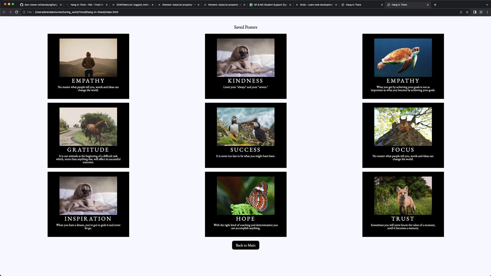

# Hang in There  

### Abstract:
This is an app that displays motivational posters. Users can create their own poster, save posters that they've created, and delete posters.
The app can be used as a motivational tool for students, at jobs, etc.
### Installation Instructions:
To access the app, go to the deployed page link [here](https://ben-rosner-williamsburg.github.io/hang-in-there/)

### Preview of App:

### Context:
We worked on this project as our Mod 1 Paired Assignment and had one week to work on it. We are in Mod 1 of the Front End Engineering program at Turing School of Software and Design.

### Contributors:
[Ben Rosner](https://github.com/ben-rosner-williamsburg)
[Brendan Turner](https://github.com/BrendanTurner1)

### Learning Goals:
- Build out functionality using functions that show trends toward SRP
- Manipulate the page after it has loaded adding, removing, and updating elements on the DOM
- Begin to understand the connection between HTML, CSS and JavaScript
- Practice reading, understanding, and using provided code
- Build an understanding of writing code collaboratively
- Document changes with atomic commits & thorough code reviews
- Communicate, troubleshoot, and plan effectively as a team
- Ensure all team members are able to be heard and contribute throughout the project

### Wins + Challenges:
- Win: Figuring out the Delete Poster functionality.
- Win: Manipulating HTML using the DOM.
- Challenge: Figuring out event listeners.
- Win: Figuring out the save poster functionality.
